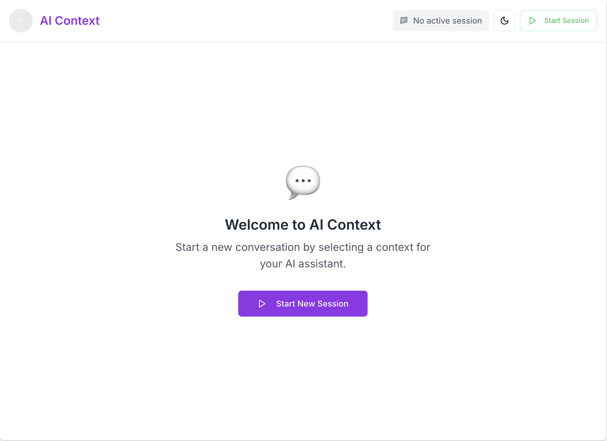
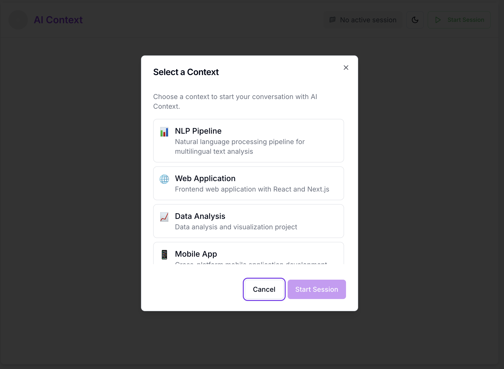
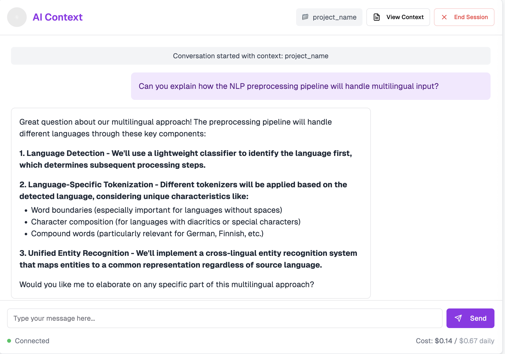
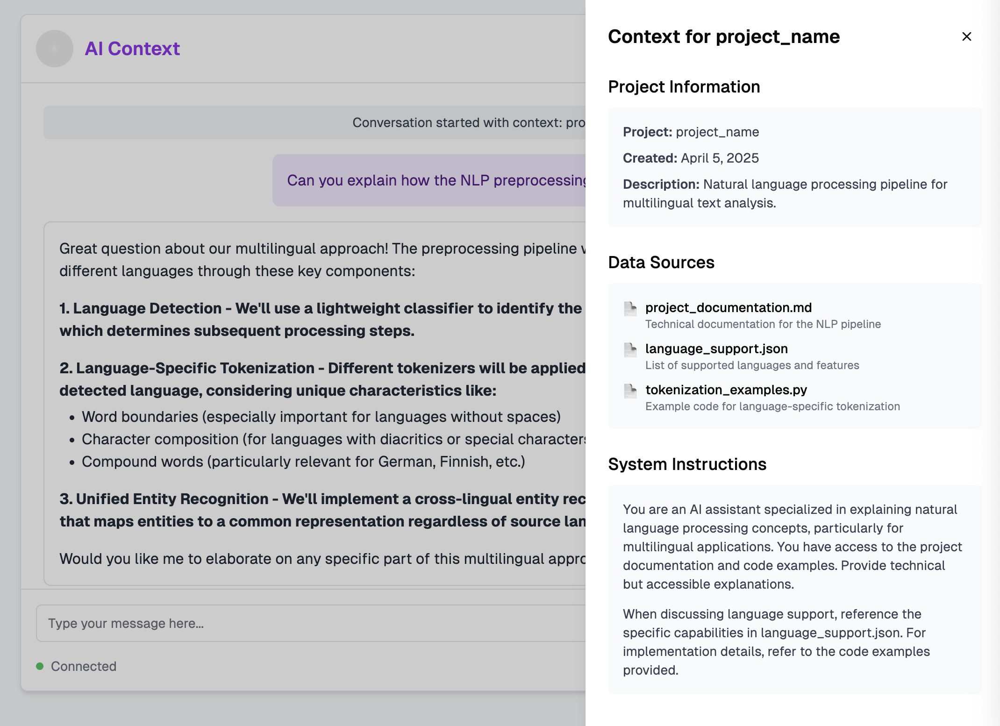

# 🧠 AI Context

**AI Context** is a web-based chat tool for maintaining rich project context in AI conversations. It enables focused conversations tied to specific projects, documents, or codebases—powered by a structured context system.

Designed for anyone who need deeper, context-aware AI collaboration.

---

## 🖼️ Screenshots

### Start of a Chat Session

### Select a Project Context

### Live Chat

### Context Panel

---

## ✨ Features (UI-Only MVP)

### 🧩 Context-Aware Sessions
- Start new chat sessions scoped to a specific context
- Choose from available project contexts via modal
- View context info in a sliding panel during a session

### 💬 Chat Interface
- Send messages and receive intelligent AI responses *(mocked or placeholder responses for now)*
- Markdown support for assistant replies
- Grouped message display with timestamps and avatars
- Typing indicators and loading states for responsiveness

### 🛠 UI/UX
- Responsive design for desktop and mobile
- Dark/light mode toggle
- Clear error states with retry options
- Smooth animations and accessibility built-in

---

## ⚠️ Work in Progress

This is currently a **frontend-only MVP** focused on validating the user interface and interaction patterns. There is **no backend or AI integration yet**.

### Next Up:
- [ ] **Backend API integration** with LLM (e.g. OpenAI, Claude, etc.)
- [ ] **Persistent chat history** (localStorage or database)
- [ ] **Load context data from filesystem or remote source**
- [ ] **Streamed assistant responses**
- [ ] **Context creation/editing in UI**
- [ ] **Session list / history page**
- [ ] **Authentication (optional)**

---

## 📁 Context Management

AI Context Chat is designed to work seamlessly with the upcoming [Context Core library](https://github.com/alatruwe/context-core) project:

- Store context as structured markdown or JSON
- Version and manage multiple context types (code summaries, project briefs, etc.)
- Easily update the UI contexts from a shared location or repo

---
## Technology Stack

- **Framework**: Next.js 14+ with App Router
- **UI Library**: React 18+
- **Styling**: Tailwind CSS with shadcn/ui components
- **State Management**: React Hooks
- **Server Actions**: Next.js Server Actions for API calls